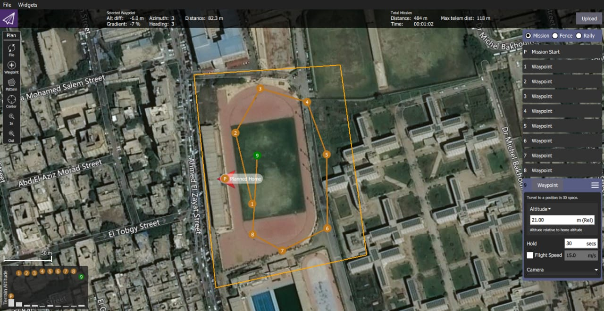

       Check that every hardware is assembled correctly and every connection to the Pixhawk before advancing through
-----------------------------------------------------------------------------------------------------------
# Arming the vehicle
* PX4 has explicit states for powering (arming) the vehicle components:
  
  ###### - Disarmed: there is no power to motors or actuators (servos).
  ###### - Prearmed: Actuators and other non-dangerous electronics are powered.
  ###### - Armed: Vehicle is fully powered, including motor/propeller.
  
* It's necessary to disable the **Safety Switch** from parameters if no real safety switch is used, otherwise the arming would fail and the vehicle would not response to any action; to disable the safety switch:

   select the parameters icon and change the value of **CBRK_IO_SAFETY** to 22027

* You can now check that your modes are working properly and then fly the vehicle

* For more info about the vehicle arming check the user guide [Prearm/Arm/Disarm Configuration](https://docs.px4.io/master/en/advanced_config/prearm_arm_disarm.html)

### A problem that occured during mounting the pixhawk
the pixhawk gave an error of **low avionics power**, we solved this problem by disabling the following parameter **(CBRK_SUPPLY_CHK)** 
**only do this if this error occured or you did not find any other solution (better search more for this problem if it occured or change the hardware(power module)) **
_______________________________
# Check Motor and Actuators
- You have to check your porpulsion system is working properly while arming the vehicle and with the Radio transmitter, and the motor should be able to get full throttle 
- You have also to check that your servos work functionally and the Pitch/Roll/Yaw surfaces respond to the RC stick movement and they get the maximum deflection
- **Error** 

        The stability mode actions are reserved (when the plane is unstable the elevator moves into wrong directions

  ###### A primary solution to this problem is to change the value to parameter PWM_MAIN_REV2 (the elevator channel is ch2) 
________________________________________________________________________________________________________________
# Planning Missions (using QGROUNd-CONTROL planner) 
 #### Switch to *Mission View* > Click *Plus* Icon  to add waypoints > Select the waypoint type from the list to the right > Click *Upload* 

 #### > The mission will be displayed into the *flight view*
 #### > Mode Hold:
 ###### Add a waypoint of type hold so the plane can loiter before a safe landing
________________________________________________________________________________________________________________
# Adding a Geo-fence
#### To avoid crashing into buildings, a geofence should be added 

### Parameters to be changed or edited
1. NAV_ACC_RAD: it is called the acceptance radius, it modifies the turning sharpness.
2. NAV_LOITER_RAD: it specifies the turning radius.
3. NAV_LTRMIN_ALT: it specifies the minimum altitude on which the fixedwin is flying (you can make it haigher than the building to avoid crashing)
